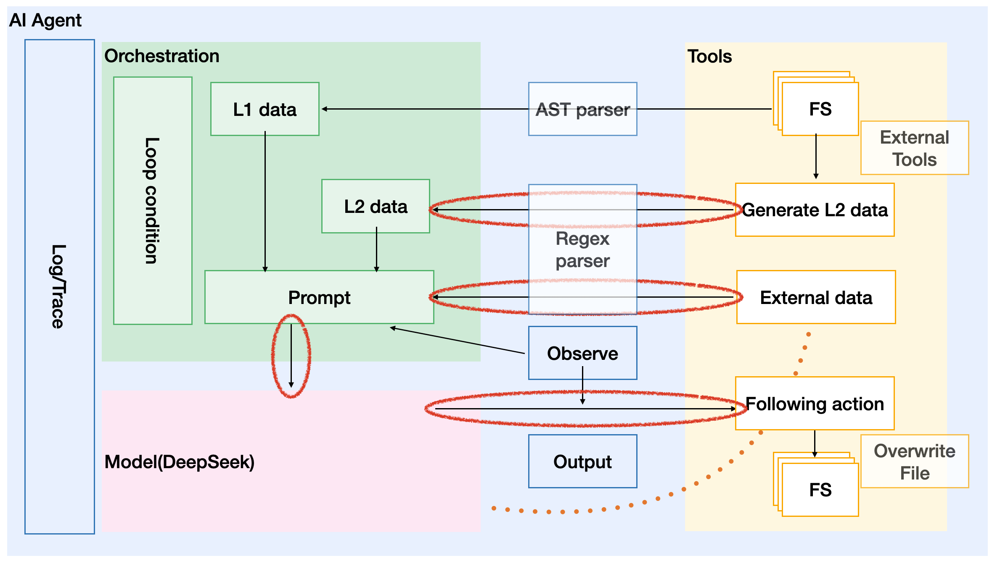

# Hello, World! OpenAI Code Agent

[](https://github.com/SamYuan1990/OpenAI_CodeAgent/actions/workflows/linter.yml)
[](https://github.com/SamYuan1990/OpenAI_CodeAgent/actions/workflows/ci.yml)

Intelligentize various pipelines based on the given repo, and stabilize the
results of source code and various tools. Under artificial consciousness
(prompt), analyze through large models.

Ref From LLMs to LLM-based Agents for Software Engineering: A Survey of Current,
Challenges and Future[1], in this paper which listed 6 topics in software
development and provided 2 approaches as LLM and LLM-based agents.

Learn from discussion among community, one short style prompt for now. As
Noticed that like DeepSeek R1, the CoT[4] been integrated into model itself,
having ReAct[2] or not at AI Agent side is an open question. As we running as a
github action, so far, RAG is not an option, as we don't maintain a DB. Remote
function execution? Open question.



Meanwhile, ref to ReAct[2], to restrain hallucination, in this project, we
prefer Fact instead of multiple AI agent interaction or LLM interaction as
ToT[3] for now. The reason as if we can using existing tool to provide fact as
zero hallucination, why we taking risk for hallucination?

> If we make a reliability block digrom model and analysis, ToT[3] in fact like
> series connection model and transmit hallucination from previous step to the
> end.

## Functional Features:

### Loop Contorl:

For AST type tasks, you can set a maxIterations as control for max times invokes
LLM, or dry run.

### According to AST:

- [x] Checking if the function as any kind of exception handle or robust enough
- [x] Checking if we need to add comments at begin of a specific function for
      people to understand the code.
- [ ] Checking if function as owasp top 10 issues as new pointer or others.
- [ ] etc... welcome for contribute your idea by new issue.

### According to additional metadata:

- [x] Comparing with SBOM and CVE list, checking security option in your
      deloyment.
- [ ] According to project setting as package.json/makefile to check if your
      project config is correct.
- [ ] Accroding to test result, for example escape detection result, locate code
      and provide fix suggestion.
- Checking if function leak
- [x] unit test
- [ ] benchmark test
- [ ] fuzz
- [ ] etc... welcome for contribute your idea by new issue.

## Non Functional features:

- [x] hash base tracing, and output from LLM.
  > To trace the log, you can try to trace with hashValue is sha256 hex of final
  > prompt.

### Metric

I suppose metrics with different points of view are needed.

- [x] Consider running in loop, we need to have a trace for each specific round.
- [ ] Token spent, which related to your cost.
- [x] Prompt component, a prompt can be one shot, or ReAct[2], or different
      styles, so having a Prompt component metric, may help you know the prompt
      well.
- [ ] Output effective parts, some times LLM's repsonse contains parts we don't
      interested with. So an output effective part, for how many things been
      filter out.

### GHA logging

As we running as a GHA, so GHA logging also provided as trace.(if you run with
docker, it seems double tracing/logging.)

## Outputs

| Output              | Description                                                                              |
| ------------------- | ---------------------------------------------------------------------------------------- |
| avg_prompt_precent  | The avg precent of prompt(human intention)/ final prompt string.                         |
| avg_content_precent | The avg precent of content(the content backgroud of specific task)/ final prompt string. |
| LLMresponse         | The LLM response if we just have one of it.                                              |
| final_prompt        | The final prompt send to LLM as task.                                                    |

If you run things with AST tree, you can find output at dir: `./GenAI_output`,
which single file looks like below, here the hashValue is sha256 hex of final
prompt.

```json
{
  "model": "deepseek-chat",
  "final_prompt": "...",
  "hashValue": "600e13336953ff55998a56a86644a01abfabe33513abcf01b8d945c61664e0c2",
  "response": "",
  "prompt_precent": 12.718204488778055,
  "content_precent": 87.03241895261846,
  "meta": {
    "filename": "src/aiagent.js",
    "functionname": "calculatePercentage"
  }
}
```

### Overwrite source code vs Create new Github issue?

For output, considering with AI Ethical, provide output as new github issue or
overwrite the source code, leave user to open PR for merge. if overwrite source
code, then leave to user to use create branch/create PR action to make the code
back to repo. Otherwise, just create new github issue or save data in to a
folder for upload to Github artifactory.

## Pipeline Integration(tbd)

Please ref files begin with Example at [here](./.github/workflows/)

## Test Locally

```
npm run all
npx local-action . src/index.js .env.example
```

## Ref

[1] From LLMs to LLM-based Agents for Software Engineering: A Survey of Current,
Challenges and Future, arXiv:2408.02479v1 [cs.SE] for this version,
https://doi.org/10.48550/arXiv.2408.02479

[2] REACT:SYNERGIZING REASONING AND ACTING IN LANGUAGE MODELS,arXiv:2210.03629
[cs.CL] https://arxiv.org/abs/2210.03629v3

[3] Tree of Thoughts: Deliberate Problem Solving with Large Language Models,
arXiv:2305.10601 [cs.CL] https://arxiv.org/abs/2305.10601v2

[4] Chain-of-Thought Prompting Elicits Reasoning in Large Language Models,
arXiv:2201.11903 [cs.CL] https://arxiv.org/abs/2201.11903v6

## Pre Release check

1. scan this repo for unit test generation
   > To check file generation logic
1. scan kubeedge for document generatin
   > To check General comments insert logic
1. scan kepler repo for cve scan
   > To check file in issue logic

## Todo:

- Enhance unit test file logic To do, make it in unit test.

- General function replace logic
- file level skipper
- functional level skipper
- Framework define for flexiable
