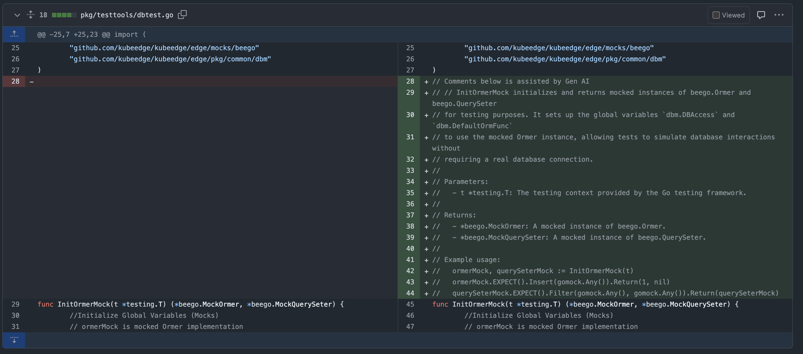
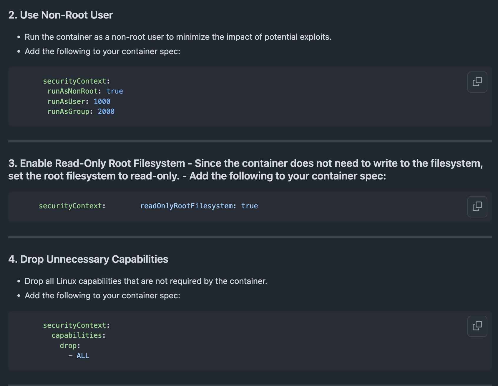
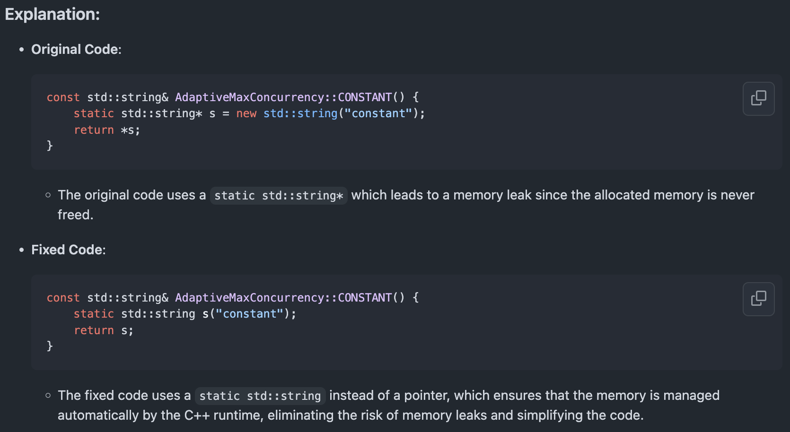
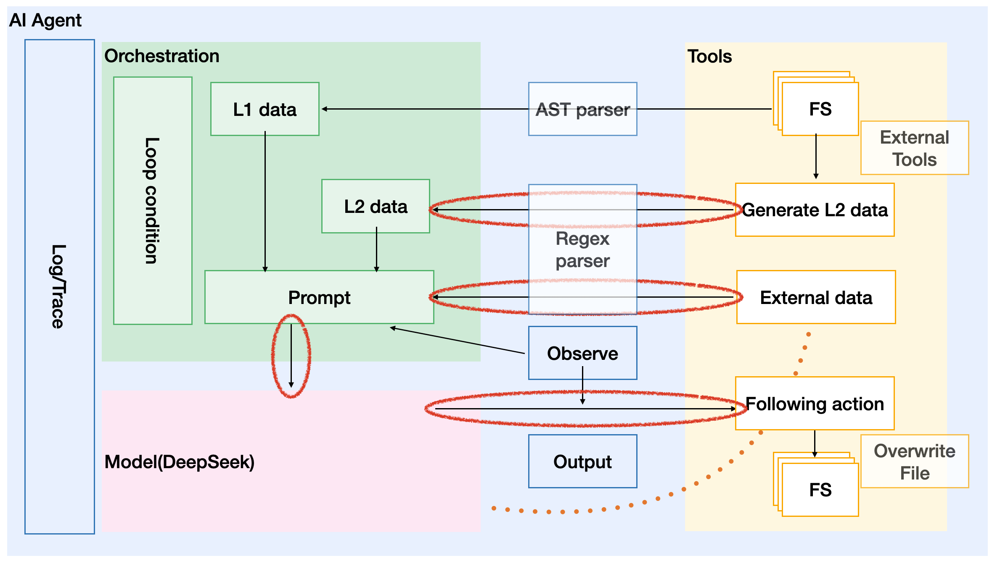
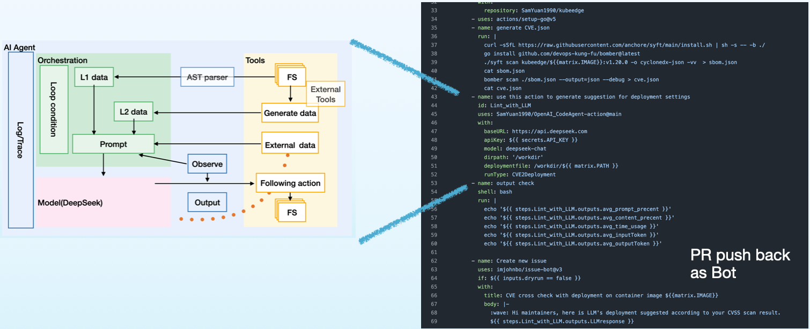

# 👔 Introduction

From an engineering perspective, for the tasks in our pipeline today, we need to
gather sufficient information and construct a series of specific instructions.
By directly issuing these instructions to the large model, we can avoid
fine-tuning and RAG (Retrieval-Augmented Generation), thereby integrating the
large model into the pipeline. This approach enables intelligent solutions to
specific problems, ultimately achieving the goal of enhancing production
efficiency.

Modern software engineering follows a structured path—from gathering
requirements to deploying the final product. Copilot has reshaped how developers
transition from ideas to code, yet a critical gap remains: the untapped
potential of automated intelligence in CI/CD pipelines.

Today's CI/CD pipelines handle a vast amount of structured data—source code,
test results, security scans, and dependency reports. However, these artifacts,
generated by existing tools, are underutilized. They provide raw data but lack
deeper insights.

## So, what if we could extract meaningful analysis from this structured information?

Our project enhances CI/CD workflows by integrating intelligent automation,
transforming existing toolkits into a context-aware assistant. This enables: ✅
More effective security assessments ✅ Proactive insights that support
engineering decisions

> This isn’t just about automation—it’s about making CI/CD pipelines more
> adaptive, efficient, and responsive.

# 📊 Results

## PR or Github issue

🔒 As our scan result related with vulnerability, we hidden all details in
result to avoid hacker exploitation.

- We already get 3 confirmed dependency update in cloud related project for
  security.
- We submitted 1 PR to Apache project for enhancement.

## Metrics

We define metrics for evaluate our jobs' effectively.

- Prompt percent: The percent of prompt as human intention in question asked to
  LLM.
- Content percent: The percent of a specific function or files as content in
  question asked to LLM.
- Output Token: The numbers token as LLM's response.
- LLM response time: The duration for LLM's response.

## Summary table

| Metric\Task               | Document generate | Deployment suggestion | Code enhancement |
| ------------------------- | ----------------- | --------------------- | ---------------- |
| Prompt percent            | 16%               | 5.6%                  | 54.2%            |
| Content percent           | 83%               | 93%                   | 45%              |
| Output Token              | 430               | 1207                  | 742              |
| LLM response time(second) | 26                | 61                    | 43               |

# 👀 Exmaple

## CI Integration

| Category                       | Tools        | Language/Target | Scenario                                                 | Example                                                     |
| ------------------------------ | ------------ | --------------- | -------------------------------------------------------- | ----------------------------------------------------------- |
| **Unit Test**                  | Jest         | JavaScript      | Auto-generate unit tests to improve coverage             | [Link](./.github/workflows/ExampleJSunittestGenerate.yml)   |
| **Doc Gen**                    |              | Go              | Generate GoDoc comments via AST analysis                 | [Link](./.github/workflows/ExampleGODocGenerate.yml)        |
| **CVE Scan with Pod security** | Syft, Bomber | deployment.yaml | Detect CVEs and suggest Pod Security Policy improvements | [Link](./.github/workflows/ExampleCVEToDeployment.yml)      |
| **CVE Scan with project**      | Syft, Bomber | n/A             | Detect CVEs and the affect to your repo                  | [Link](./.github/workflows/YouOwnCVEDependency.yml)         |
| **Code Vulnerabilities Scan**  |              | C               | Detect common CVE reasons as null pointer for code       | [Link](./.github/workflows/ExampleCVulnerabilitiesscan.yml) |

## Document generate

## Deployment suggestion

In this part, we just scan "hello world" deployment yaml, either they are used
for integration test or quick start for user. No production deployment.

## Code enhancement

# ✨ Image this

🌴 You're on a sun-soaked beach, sipping a mojito, watching the waves roll in.
Carefree. Relaxed. Your code? It’s running itself in—an intelligent pipeline
scanning CVEs, analyzing risks, and auto-adjusting deployments.

Now, contrast that with this:

💻 You’re hunched over your desk, chugging coffee at 2 AM, manually digging
through security reports, tweaking YAML files, and writing function doc strings
one by one.

The choice is yours. Hack smarter, not harder. Let AI do the grunt work while
you enjoy the sunset.

# ✏️ Methodology

On one hand, referencing the [ReAct](https://arxiv.org/abs/2210.03629), LLMs
generate reliable, hallucination-free responses when provided with sufficient
ground truth data. With reasoning technologies like Chain of Thought (CoT), LLMs
can analyze patterns, detect anomalies, and surface actionable insights.

On the other hand, modern software scanning tools already generate structured
data, but they lack the ability to interpret, connect, and act on it.

## The Challenge:

🔥 Can we extract real intelligence—without RAG, without fine-tuning, just
results? 

Let's shake hands, make it happen. By ground truth as source code or structured
reports, with a clear human intention, ask LLM to deal with the task. Using
Google's AI Agent design style to explain our design, we implements tools read
data from both source code and structured reports, with prompt as prefix
represent human intention.

🔥 Can we upgrade CI/CD pipelines from passive scanners to AI-driven assistants?
 Yep, we package this
AI agent as a github action as a part of CI/CD pipeline code!
